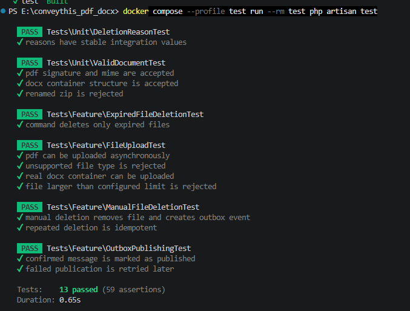

# ConveyThis File Vault

Laravel application for temporary PDF/DOCX storage. Files are uploaded asynchronously, stored privately, listed and downloaded through the application, and deleted manually or automatically after 24 hours. Every deletion creates a durable RabbitMQ email-notification event through a transactional outbox.

## Features

- AJAX upload with jQuery `FormData` and a live progress bar
- server-side extension, detected MIME and configurable size validation
- private storage with generated UUID paths and SHA-256 checksums
- MySQL metadata with explicit, indexed `expires_at`
- paginated Bootstrap management page
- manual download and idempotent deletion
- scheduled deletion in bounded chunks
- a transactional outbox for reliable RabbitMQ publication
- durable exchange/queue, persistent messages, mandatory routing and publisher confirms
- exponential publication retry
- Docker Compose environment and GitHub Actions CI
- feature tests for upload, validation, deletion, expiration and outbox failure paths

## Requirements

The recommended setup requires only:

- Docker Engine 24+
- Docker Compose v2

The Docker build pins PHP 8.3, Laravel 13-compatible dependencies, MySQL 8.4, RabbitMQ 4, Node 22 and Nginx.

## Quick start

```bash
cp .env.example .env
docker compose up -d --build
docker compose exec app php artisan key:generate
docker compose exec app php artisan migrate --force
```

also instead of 
```bash
docker compose exec app php artisan key:generate
```
you can use:
```bash
docker compose exec app php artisan key:generate --show
```
and put this key in .env

Open:

- application: [http://localhost:8080](http://localhost:8080)
- RabbitMQ management: [http://localhost:15672](http://localhost:15672)

Default local RabbitMQ credentials are `file_vault` / `secret`. Change all example credentials before deploying outside a local environment.

## Verification

Check container state:

```bash
docker compose ps
docker compose logs --tail=100 app scheduler
```

Run the automated test suite in its isolated SQLite container:

```bash
docker compose --profile test run --rm test php artisan test
```

Check PSR-12/Laravel formatting:

```bash
docker compose --profile test run --rm test vendor/bin/pint --test
```

The production image contains frontend assets built in a separate Node stage. For an additional standalone frontend check, use Node 22 on the host and run `npm ci && npm run build`.


## Test cases

### Automated coverage

| Test class | Test case | Expected behavior |
| --- | --- | --- |
| `FileUploadTest` | PDF upload | Stores the private file and metadata and returns HTTP 201 JSON. |
| `FileUploadTest` | DOCX upload | Accepts a real OOXML/DOCX ZIP container. |
| `FileUploadTest` | Unsupported type | Rejects unsupported or renamed files with a validation response. |
| `FileUploadTest` | Oversized upload | Rejects a document larger than the configured limit. |
| `ManualFileDeletionTest` | Manual deletion | Removes the physical object, soft-deletes its metadata and creates an outbox event. |
| `ManualFileDeletionTest` | Repeated deletion | Keeps deletion idempotent and does not create a duplicate event. |
| `ExpiredFileDeletionTest` | Expiration command | Deletes expired files while retaining active files and records `expired` as the reason. |
| `OutboxPublishingTest` | Confirmed publication | Marks a broker-confirmed message as published. |
| `OutboxPublishingTest` | Failed publication | Retains the message, records the error and schedules a retry. |
| `ValidDocumentTest` | PDF signature | Accepts a PDF with a valid detected MIME type and signature. |
| `ValidDocumentTest` | DOCX structure | Accepts a DOCX containing the required OOXML entries. |
| `ValidDocumentTest` | Renamed ZIP | Rejects a generic ZIP renamed to `.docx`. |
| `DeletionReasonTest` | Stable values | Protects the `manual` and `expired` integration-contract values. |

Run all tests:

```bash
docker compose --profile test build test
docker compose --profile test run --rm test php artisan test
```

You should see same result as here:


Run one test class:

```bash
docker compose --profile test run --rm test php artisan test --filter=ExpiredFileDeletionTest
```

### Manual upload and download

1. Open [http://localhost:8080/files](http://localhost:8080/files).
2. Upload a valid `.pdf` and a valid `.docx`, each smaller than 10 MB.
3. Confirm each row appears without a page reload.
4. Download both documents and verify their original filenames and contents.
5. Attempt to upload an unsupported, renamed or oversized file and confirm it is rejected.

### Manual deletion and RabbitMQ event

1. Upload a new document and delete it from the management page.
2. Confirm the row disappears and the file can no longer be downloaded.
3. Run `docker compose exec app php artisan outbox:publish -vvv`.
4. Confirm the command reports `Published: 1; failed: 0.`.
5. Open RabbitMQ Management → Queues and Streams → `email.notifications`.
6. Inspect the persistent `file.deleted` JSON message and confirm that:
   - `data.deletion_reason` equals `manual`;
   - `recipient` matches `DOCUMENT_NOTIFICATION_EMAIL`.

### Deterministic expiration test

Stop the scheduler so it cannot race with the manual test:

```bash
docker compose stop scheduler
```

Upload a new document, then expire the newest active row:

```bash
docker compose exec mysql mysql -ufile_vault -psecret file_vault -e "UPDATE stored_files SET expires_at=UTC_TIMESTAMP()-INTERVAL 1 MINUTE WHERE deleted_at IS NULL ORDER BY id DESC LIMIT 1;"
docker compose exec app php artisan files:delete-expired -vvv
```

The command must report:

```text
Deleted 1 expired file(s).
```

Verify the database state:

```bash
docker compose exec mysql mysql -ufile_vault -psecret file_vault -e "SELECT id,original_name,expires_at,deleted_at,deletion_reason FROM stored_files ORDER BY id DESC LIMIT 1; SELECT id,event_type,attempts,published_at,JSON_UNQUOTE(JSON_EXTRACT(payload,'$.data.deletion_reason')) AS reason FROM outbox_messages ORDER BY created_at DESC LIMIT 1;"
```

Expected state:

- `deleted_at` is populated;
- `deletion_reason` equals `expired`;
- the outbox event payload reason equals `expired`;
- the physical file is absent from the private storage disk;
- the outbox row exists with `published_at = NULL`.

Publish and inspect the expiration event:

```bash
docker compose exec app php artisan outbox:publish -vvv
```

The command must report:

```text
Published: 1; failed: 0.
```

Open RabbitMQ Management → Queues and Streams → `email.notifications` and confirm that the new `file.deleted` message contains:

```json
{
  "event_id": "4d2c52a0-8133-4e02-95b1-395f2b35eb2c",
  "event_type": "file.deleted",
  "occurred_at": "2026-08-31T21:30:00+00:00",
  "recipient": "notifications@example.com",
  "data": {
    "file_id": "01K...",
    "original_name": "document.pdf",
    "mime_type": "application/pdf",
    "size_bytes": 248120,
    "checksum_sha256": "...",
    "uploaded_at": "2026-08-30T21:29:00+00:00",
    "expires_at": "2026-08-31T21:29:00+00:00",
    "deletion_reason": "manual"
  }
}
```

Restart the scheduler after completing the deterministic test:

```bash
docker compose start scheduler
```

### Scheduler end-to-end test

1. Upload another document.
2. Set its `expires_at` to the past using the SQL command above.
3. Leave the scheduler running.
4. Do not execute `files:delete-expired` or `outbox:publish` manually.
5. Within one minute, confirm that the file is soft-deleted with `deletion_reason = expired`.
6. Within the following ten seconds, confirm that the outbox row has a non-null `published_at`.
7. Confirm that RabbitMQ contains the corresponding notification event.

Check scheduler logs:

```bash
docker compose logs --tail=100 scheduler
```

The scheduler runs expiration every minute and outbox publication every ten seconds.


## Manual scenario

1. Upload a `.pdf` or `.docx` file smaller than 10 MB.
2. Confirm that it appears in the table without a page reload.
3. Download it and compare the filename/content.
4. Delete it from the page.
5. Open RabbitMQ Management → Queues → `email.notifications`.
6. Confirm that a persistent `file.deleted` JSON message is present.

To test expiration without waiting 24 hours, set a row's `expires_at` to the past and run:

```bash
docker compose exec app php artisan files:delete-expired
docker compose exec app php artisan outbox:publish
```

The scheduler container normally runs expiration every minute and outbox publication every ten seconds.

## Configuration

Important `.env` variables:

| Variable | Default | Purpose |
| --- | --- | --- |
| `DOCUMENT_DISK` | `documents` | Laravel private filesystem disk |
| `DOCUMENT_MAX_SIZE_MB` | `10` | Server-side upload limit |
| `DOCUMENT_RETENTION_HOURS` | `24` | Retention from upload time |
| `DOCUMENT_NOTIFICATION_EMAIL` | example address | Recipient embedded in the event |
| `RABBITMQ_EXCHANGE` | `file.events` | Durable topic exchange |
| `RABBITMQ_QUEUE` | `email.notifications` | Durable notification queue |
| `RABBITMQ_ROUTING_KEY` | `file.deleted` | Deletion routing key |

The Nginx and PHP upload limits are deliberately aligned with the 10 MB application limit. When changing `DOCUMENT_MAX_SIZE_MB`, also update `docker/nginx/default.conf` and `docker/php/php.ini`.

## Design decisions

The core flows and consistency trade-offs are described in [docs/ARCHITECTURE.md](docs/ARCHITECTURE.md). Highlights:

- Controllers only translate HTTP concerns.
- Application actions own upload/deletion use cases.
- `DocumentStorage` and `DeletionEventPublisher` are narrow infrastructure ports.
- PDF and DOCX do not have separate adapters because format is a validation concern, while the storage backend is an infrastructure strategy.
- No generic repository wraps Eloquent for a single small aggregate.
- Manual and scheduled deletion use the same row-locked action.
- Logical deletion and the notification event are committed together.

## Project layout

```text
app/
├── Application/Files/Actions     use-case orchestration
├── Application/Files/DTO         immutable transfer objects
├── Domain/Files/Contracts        storage and messaging ports
├── Domain/Files/Enums            stable business values
├── Infrastructure/Messaging      RabbitMQ adapter
├── Infrastructure/Storage        Laravel Filesystem adapter
├── Http                           controllers, validation and resources
└── Models                         Eloquent persistence models
```

## Local non-Docker development

Requires PHP 8.3 with `bcmath`, `intl`, `mbstring`, `pcntl`, `pdo_mysql`, `pdo_sqlite` and `zip`, Composer 2, Node 22, MySQL and RabbitMQ.

```bash
cp .env.example .env
composer install
php artisan key:generate
php artisan migrate
npm ci
npm run build
php artisan serve
```

Run `php artisan schedule:work` in a second terminal.

## AI disclosure

The prompts and the division between developer decisions and AI-assisted implementation are recorded in [docs/AI_USAGE.md](docs/AI_USAGE.md).
